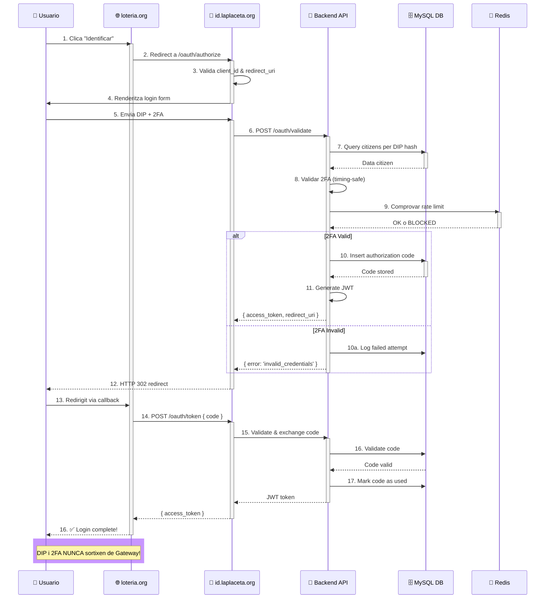
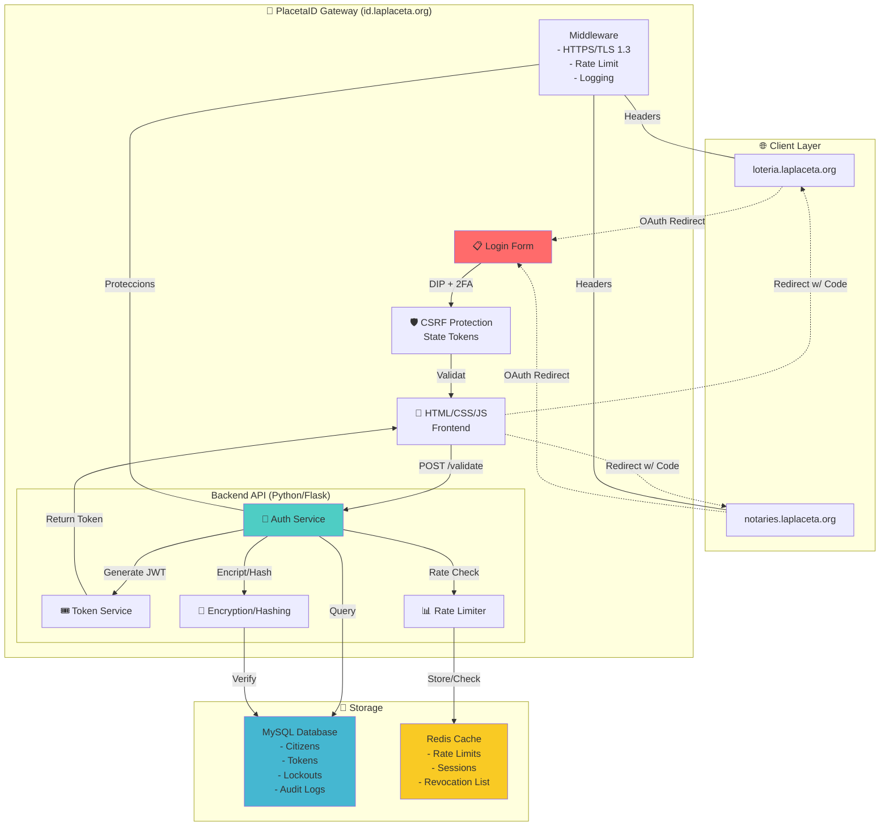
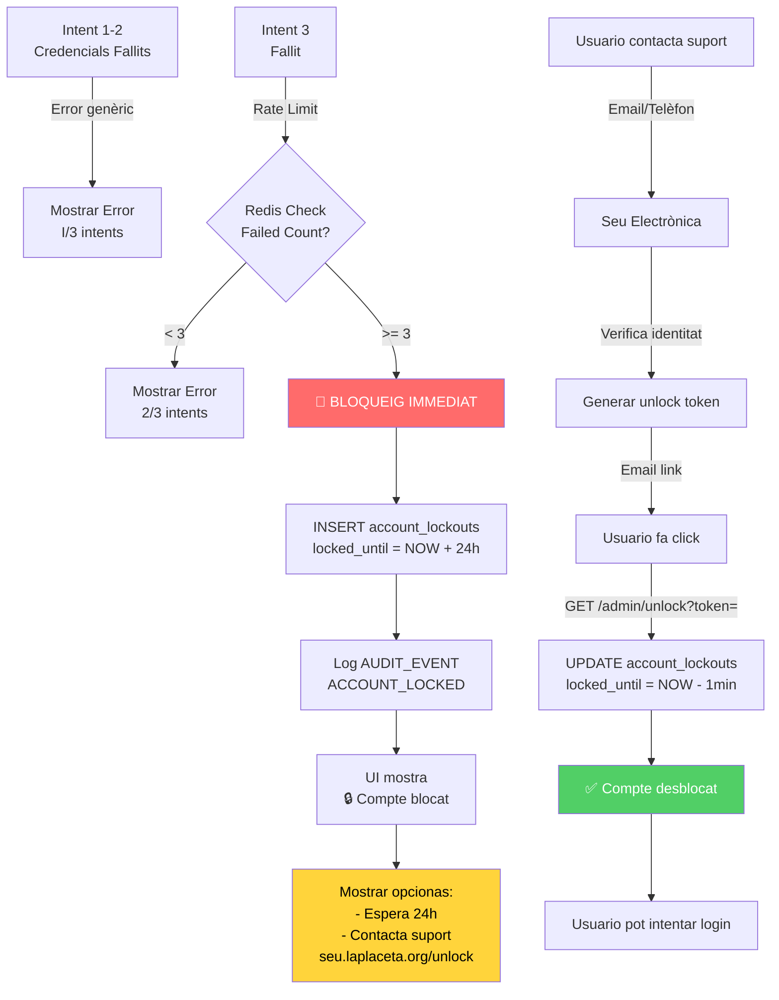
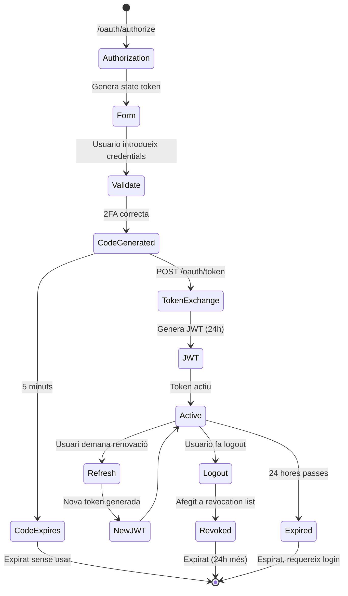
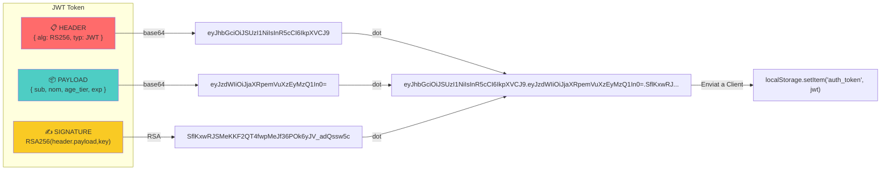
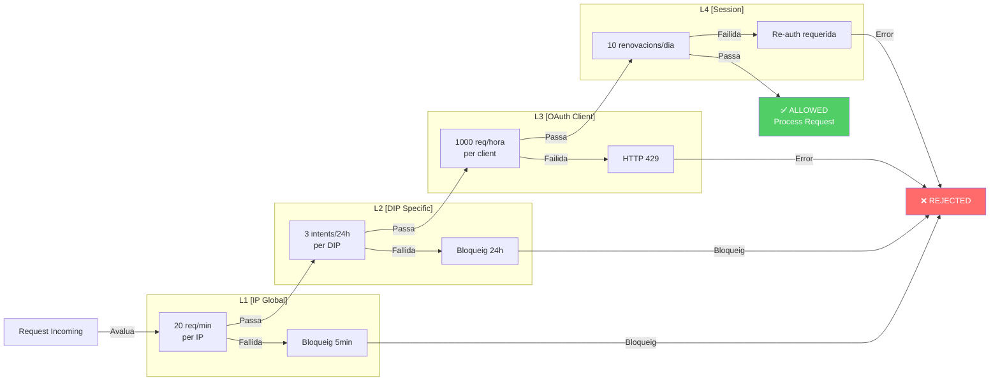
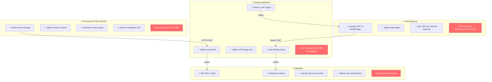
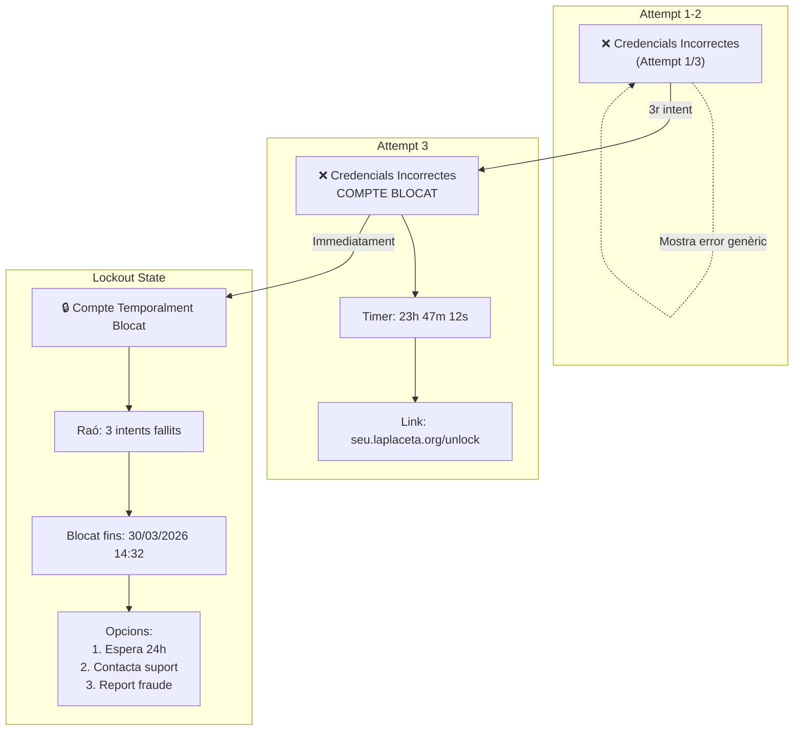
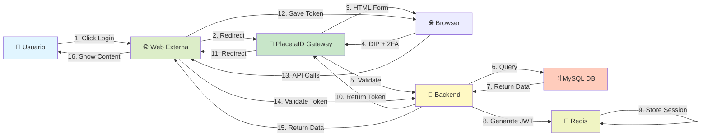

# DIAGRAMES I FLUXOS VISUALS

## 1. FLUX PRINCIPAL D'AUTENTICACIÓ (Diagrama Sequence)



## 2. ARQUITECTURA DE SEGURETAT (Diagrama C4)



## 3. FLUX DE BLOQUEIG PER FORÇA BRUTA



## 4. CICLE DE VIDA DE TOKENS



## 5. ESTRUCTURA DE JWT



## 6. MATRIU DE SEGURETAT - Rate Limiting



## 7. RESPONSIBILITATS PER CAPA



## 8. PÀGINA DE LOGIN - Wireframe

```
┌────────────────────────────────────────────────┐
│                                                │
│  ┌─────────────────────────────────────────┐  │
│  │         🔐 PlacetaID                   │  │
│  │  Identificació Segura de la Placeta   │  │
│  └─────────────────────────────────────────┘  │
│                                               │
│  ┌─────────────────────────────────────────┐  │
│  │ Has sol·licitat accés de:              │  │
│  │ 📍 loteria.laplaceta.org              │  │
│  └─────────────────────────────────────────┘  │
│                                               │
│  ┌─────────────────────────────────────────┐  │
│  │ 📋 DIP (Document d'Identitat)         │  │
│  │ [____] - [____] - [_]                 │  │
│  │                                        │  │
│  │ 🔐 Codi 2FA (6 dígits)                │  │
│  │ [___] [___]                           │  │
│  │                                        │  │
│  │ ⚠️  Teus dades no s'emmagatzen       │  │
│  │                                        │  │
│  │ ┌────────────────────────────────┐   │  │
│  │ │ 🔵 VALIDAR I ACCEDIR           │   │  │
│  │ └────────────────────────────────┘   │  │
│  │                                        │  │
│  │ [?] No tinc 2FA  |  [🆘] Problemes  │  │
│  └─────────────────────────────────────────┘  │
│                                               │
│ Privacitat | Termes | Seguretat | Contacte  │
│                                               │
└────────────────────────────────────────────────┘
```

## 9. ERROR STATES - Pantallas



## 10. FLUXO DE DADES - End to End



---

**Nota**: Aquests diagrames es poden renderitzar usant:
- **Mermaid Viewer**: https://mermaid.live
- **VS Code Extension**: Markdown Preview Mermaid Support
- **Confluence/Jira**: Integració nativa Mermaid

